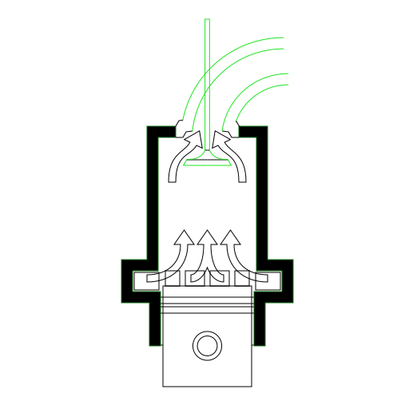

Used in [this wikipedia page](https://en.wikipedia.org/wiki/Two-stroke_engine)

The inner intersection of the top arrows seems to be drawn defective
and by fixing it in the inkscape it again is shown with the defects in the browser.
