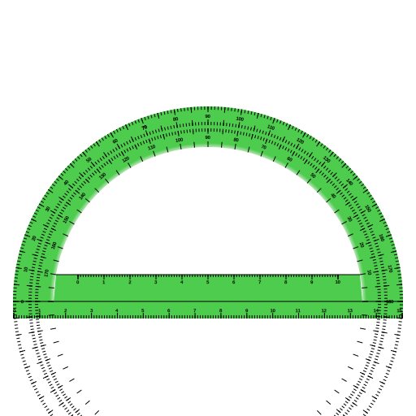

Used on [this page](https://en.wiktionary.org/wiki/protractor)

To create the degree markers, create the first left marker (at 0 degree)
and then from `Path effects` choose `Rotate copies`. In the properties of
this path effect set the x and y to the x and y of the center of the main
green circle and set the number of copies to 360. 
