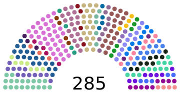

Created with [this tool](https://parliamentdiagram.toolforge.org/parlitest.php) ([source](https://github.com/slashme/parliamentdiagram))

Used in [this wikipedia page](https://fa.wikipedia.org/wiki/%D9%85%D8%AC%D9%84%D8%B3_%D8%B4%D9%88%D8%B1%D8%A7%DB%8C_%D8%A7%D8%B3%D9%84%D8%A7%D9%85%DB%8C)

Note that wikipedia does NOT allow uploading SVGs that contain scripts
