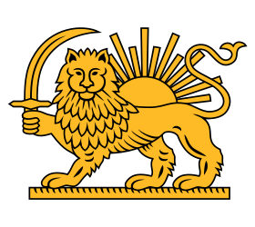

[Wikimedia page](https://commons.wikimedia.org/wiki/File:Lion_and_sun_Emblem2.svg)

For the sun rays, first the upright vertical ray was created, then other rays were created by rotating each 11.75 degrees relative to each other.
