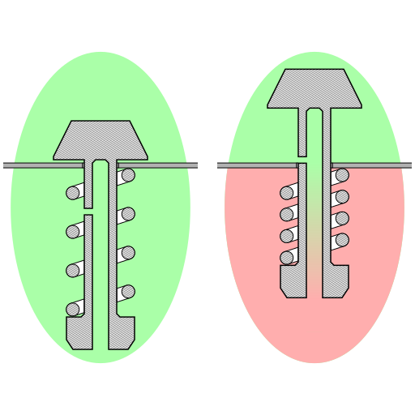

Used on [this page](https://fa.wikipedia.org/wiki/%D8%B2%D9%88%D8%AF%D9%BE%D8%B2)

The [source file](https://commons.wikimedia.org/wiki/File:Olla_a_presi%C3%B3n_v%C3%A1lvula.png)

FIXME: Fix the tangential snapping of lines to circles

To snap the stroke (outer bounding box) of an object to stroke (outer bounding box)
of another object I did this: snapped a guide to the path and then increased its x
or y by the half of the width of the stroke of the object

Wikipedia seems to have problem with patterns in thumbnails in that it shows
black fill instead of the pattern. So the workaround version of the vector
fixes this problem by reducing fill opacity and using a white redundant
path below the original path.
Note that Wikipedia seems to not support `fill-opacity` so use `opacity` instead.
