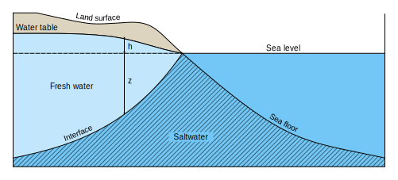

Used on [this page](https://en.wikipedia.org/wiki/Saltwater_intrusion)

Do NOT extract `fill` and `stroke` to the parent `pattern` element as wikipedia won't show it.  

FIXME: it seems that Wikipedia does not show texts along paths in the preview image, so they can be 
converted either to regular `<text>` elements (which loses the curve) or `<path>` elements (which loses
the text modifiability).  
It was fixed using `switch` element and `requiredFeatures="http://www.w3.org/TR/SVG11/feature#Text"`.
If/When Wikimedia starts supporting `textPath`s, remove switch elements along with the redundant paths.

The pattern can be tampered with by modifying its `patternTransform="matrix(3 3 -4 4 0 0)"` attribute

See [this post](https://graphicdesign.stackexchange.com/q/60536) for how to set offset of text on path
