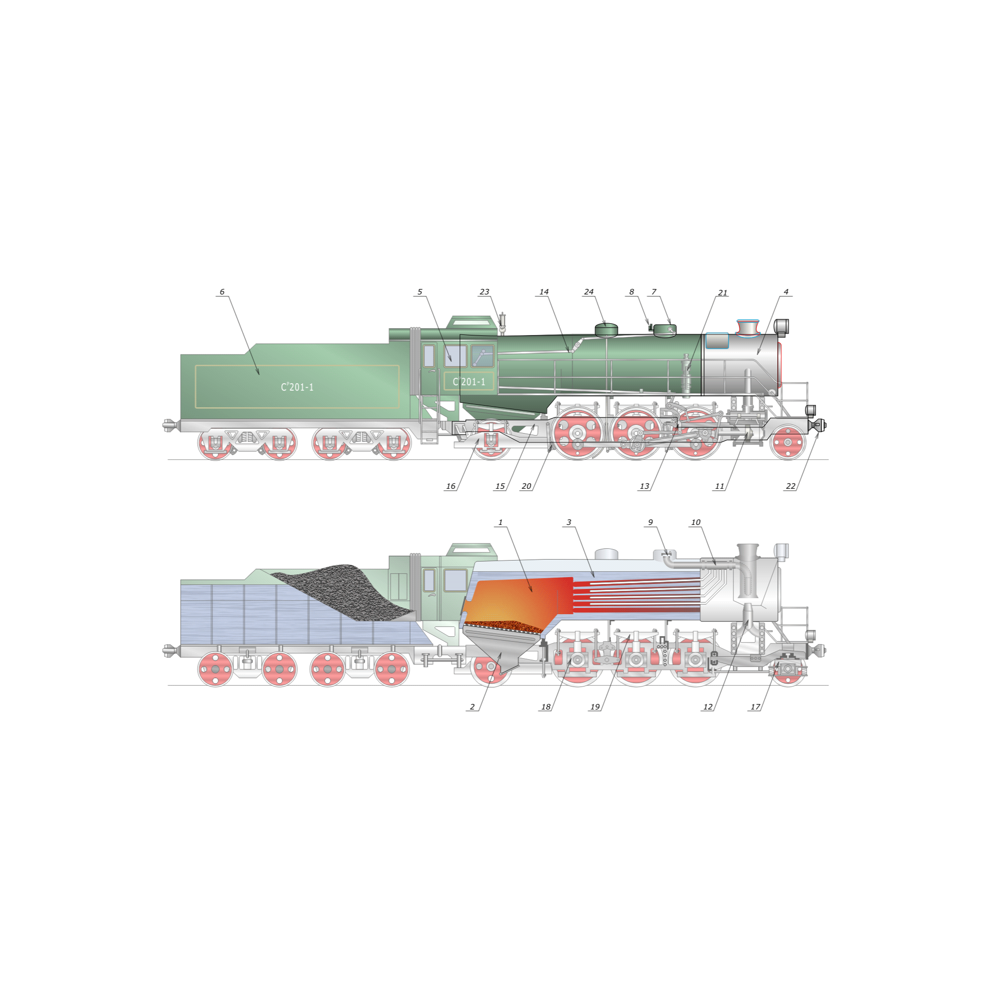

Used on [this page](https://en.wikipedia.org/wiki/Steam_locomotive)

For making the coals the following filters can be used (I chose the first one):

Image paint and draw -> Point engraving
Distort => chalk and sponge
Image effects -> film grain
Image paint and draw -> cross noise and poster
