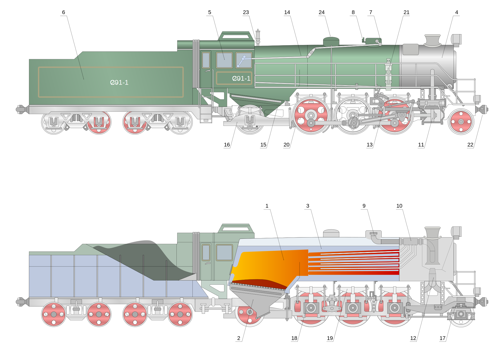

Used on [this page](https://en.wikipedia.org/wiki/Steam_locomotive)

FIXME: Update stoke width from 1px to some lower value
(also note that the default value is 1px for those that do not declare it explicitly)

For making the coals the following filters can be used (I chose the first one):

Image paint and draw -> Point engraving
Distort => chalk and sponge
Image effects -> film grain
Image paint and draw -> cross noise and poster
