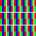

Used on [this page](https://en.wikipedia.org/wiki/Subpixel_rendering)

The vectors are created with the Inkscape clone option in Edit 🡲 Clone 🡲 Create Tiled Clones...
Note that if multiple objects together are to be cloned, they should be grouped
