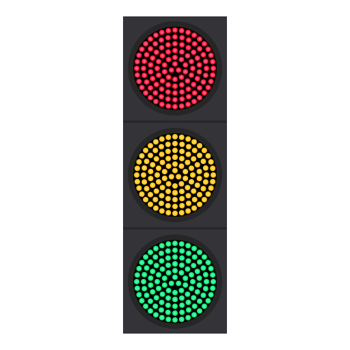

[Wikimedia page](https://commons.wikimedia.org/wiki/File:LED_traffic_light.svg)

There are two ways to create the small circles around a unit circle:
 1. Do it with the path effect called *pattern along the path* ([tutorial](https://www.youtube.com/watch?v=3jve45Z60iU))
    - This method may distort the small circles a little
 2. Create the small circles one by one and rotate them around with transformation tool
    - Make sure to reposition the rotation center of the small circles and enable *snapping to rotation center*

For how to remove all transform attributes see this [post](https://stackoverflow.com/a/41258748)
