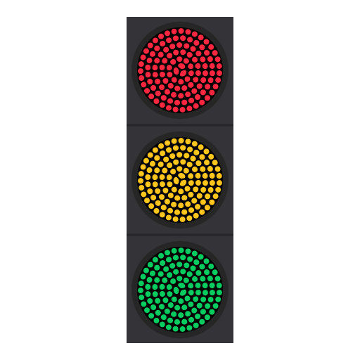

Used in [this wikipedia page](https://fa.wikipedia.org/wiki/%DA%86%D8%B1%D8%A7%D8%BA_%D8%B1%D8%A7%D9%87%D9%86%D9%85%D8%A7%DB%8C%DB%8C)

There are two ways to create the small circles around a unit circle:
 1. Do it with the path effect called *pattern along the path* ([tutorial](https://www.youtube.com/watch?v=3jve45Z60iU))
 2. Create the small circles one by one and rotate them around with transformation tool
    (Make sure to place the rotation center of the small circle first and enable *snapping to rotation center*)

For how to remove all transform attributes see this [post](https://stackoverflow.com/a/41258748)
