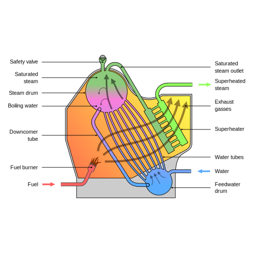
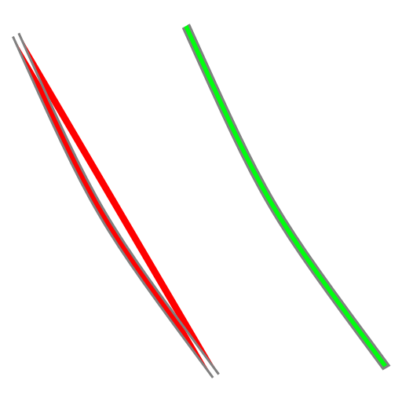

Used on [this page](https://en.wikipedia.org/wiki/Water-tube_boiler)

To create the parallel curved tubes do this:
 1. Create the first (outer) curved tube and the middle straight tube
 2. Select both of them and interpolate them (Extensions 🡲 Generate from path 🡲 interpolate)
 3. Ungroup the created interpolations
 4. Copy or mirror the generated half and past it on the other side of the middle tube
Done

To join a tube with circle, simply union the two objects (make sure the two objects completely overlap).
If it didn't work, duplicate the tube in-place, select the circle and the tube,
run Path 🡲 Cut path and then remove the unwanted parts of the circle.
Then select the circle and the tube and union them.
(fot the cut operation the tube should be the top object)
Also the operations work on the area that the fill of the object occupies
so make sure the object is connected at the end nodes (assign a fill to the object to see
its fill). See the below image:

