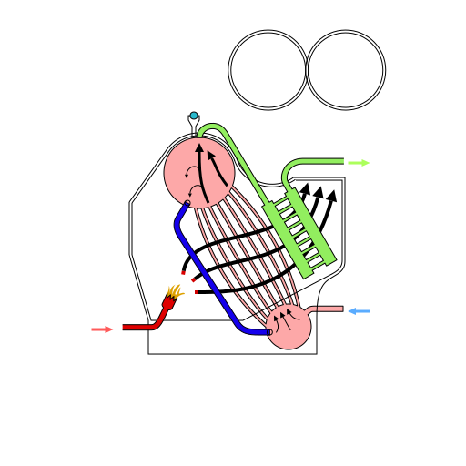

Used on [this page](https://en.wikipedia.org/wiki/Water-tube_boiler)

To create the parallel curved tubes do this:
 1. Create the first (outer) curved tube and the middle straight tube
 2. Select both of them and interpolate them (Extensions 🡲 Generate from path 🡲 interpolate)
 3. Ungroup the created interpolations
 4. Copy or mirror the generated half and past it on the other side of the middle tube
Done
