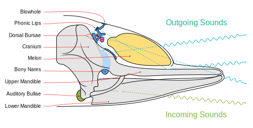

Used in [this wikipedia page](https://en.wikipedia.org/wiki/Dolphin)

The wavy line is created with the path effect called `pattern along path`;
The pattern was a zigzag curved with `interpolate points` path effect.
See [the example file](wavy-path.svg)
