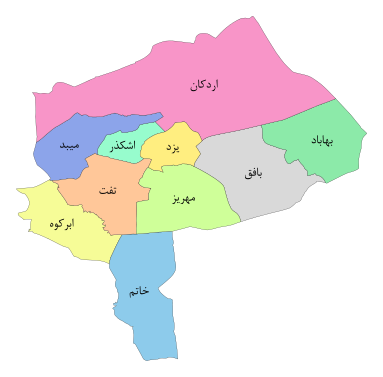

The source of the map: [Iran Amar Center](https://www.amar.org.ir/-%D8%A7%D8%B7%D9%84%D8%A7%D8%B9%D8%A7%D8%AA-%D9%85%D9%83%D8%A7%D9%86%D9%8A/%D8%AA%D9%82%D8%B3%DB%8C%D9%85%D8%A7%D8%AA-%DA%A9%D8%B4%D9%88%D8%B1%DB%8C/%D9%86%D9%82%D8%B4%D9%87-%D8%AA%D9%82%D8%B3%DB%8C%D9%85%D8%A7%D8%AA-%DA%A9%D8%B4%D9%88%D8%B1%DB%8C-1398)

Maps of Yazd Province can be seen in [this category page](https://commons.wikimedia.org/wiki/Category:Maps_of_Yazd_Province) (of course only files that have the category will appear there so make sure to add appropriate categories for files)

Colorful version is used in [this page](https://fa.wikipedia.org/wiki/%D8%A7%D8%B3%D8%AA%D8%A7%D9%86_%DB%8C%D8%B2%D8%AF)

The image map data was created with [this online tool](https://www.image-map.net/) (the commas are replaced with space in the generated code)
